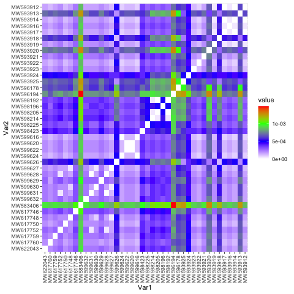
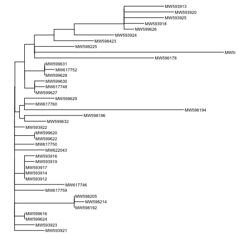
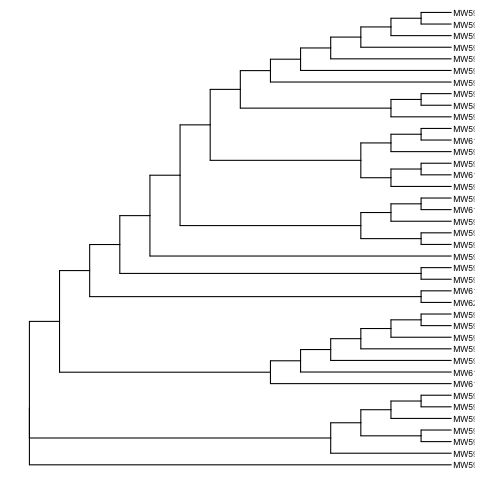

The sequence that was identified from a patient's biofluids is non-human DNA. It is likely related to the SARS-Cov-2 virus. When the sequence was run in BLAST, the 40 most similar sequences all belonged to the SARS-Cov-2.

### The following distance matrix illustrates how closely related the sequences are: 

Note how the values in the key are very small.

### This relationship is also illustrated by two phylogenies: 

1. Illustrates how some sequences are more different than others, but they seem to overall similar and related.

2. Illustrates how the different strains of the virus may have originated early on. 

This may be a warning that the person, from which the DNA was isolated, may be carrying the virus. 

\n

Since the sequences appear to be very similar, it may be possible to infer that the virus is not mutating at an incredibly fast rate. This may be good for treatment and prevention efforts. 